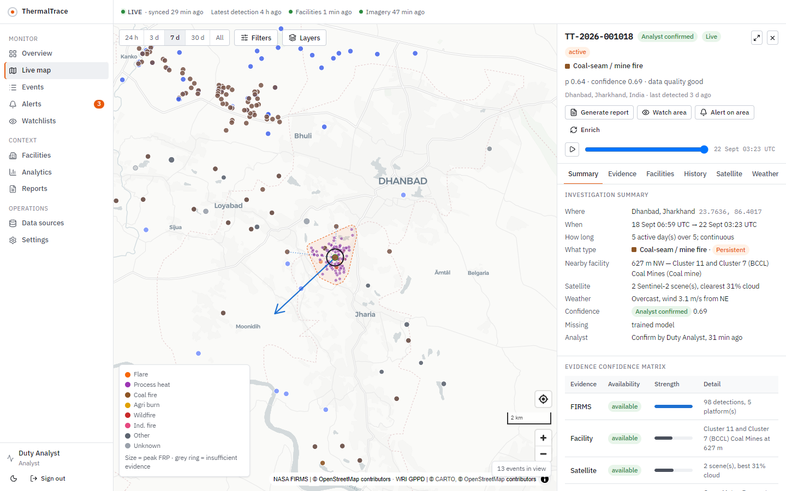
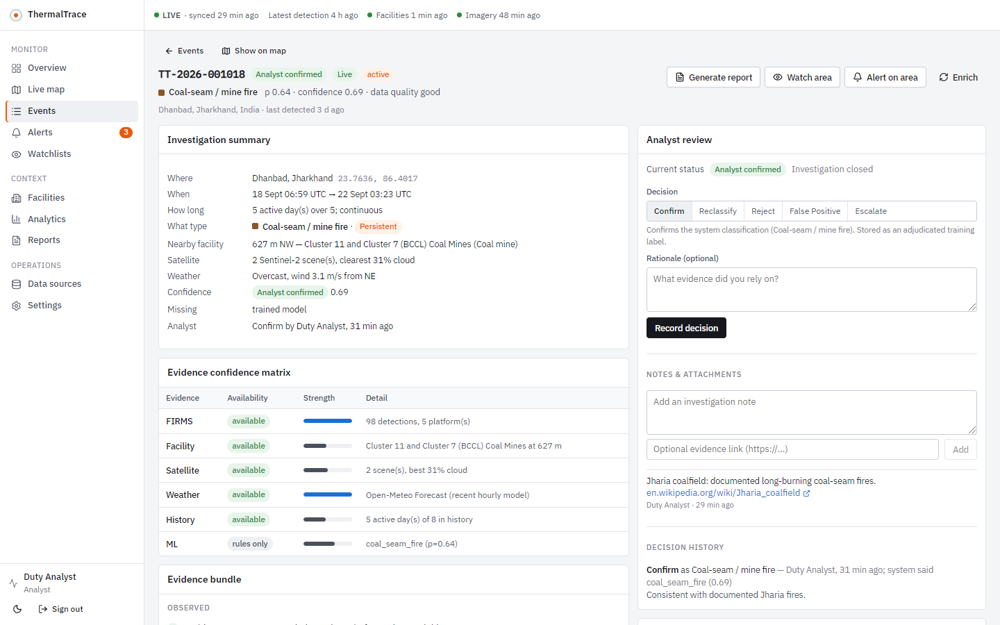
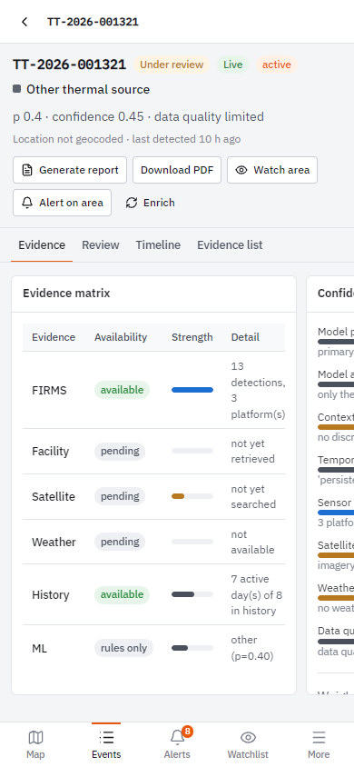
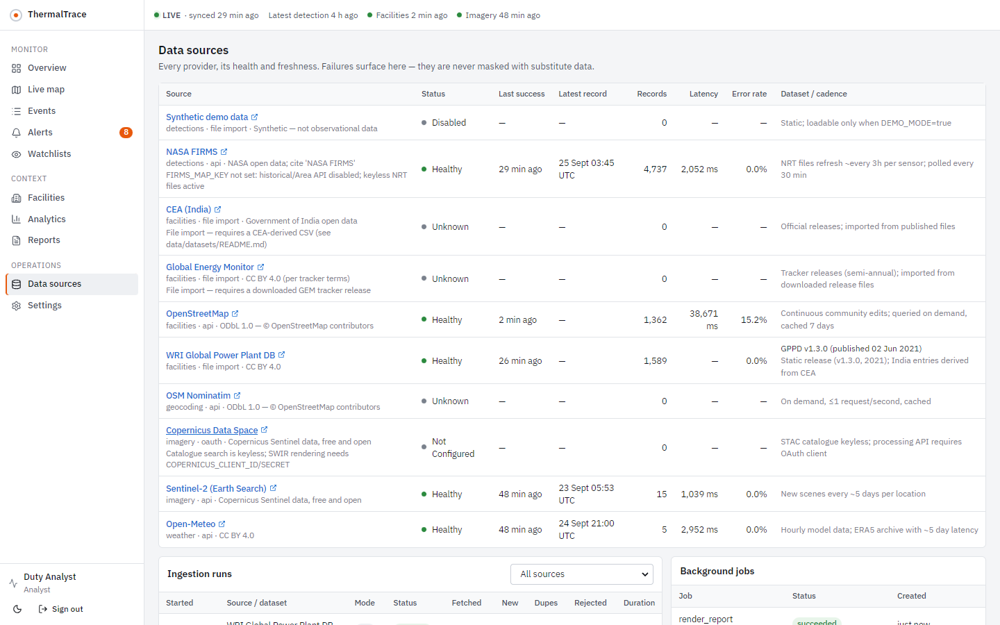
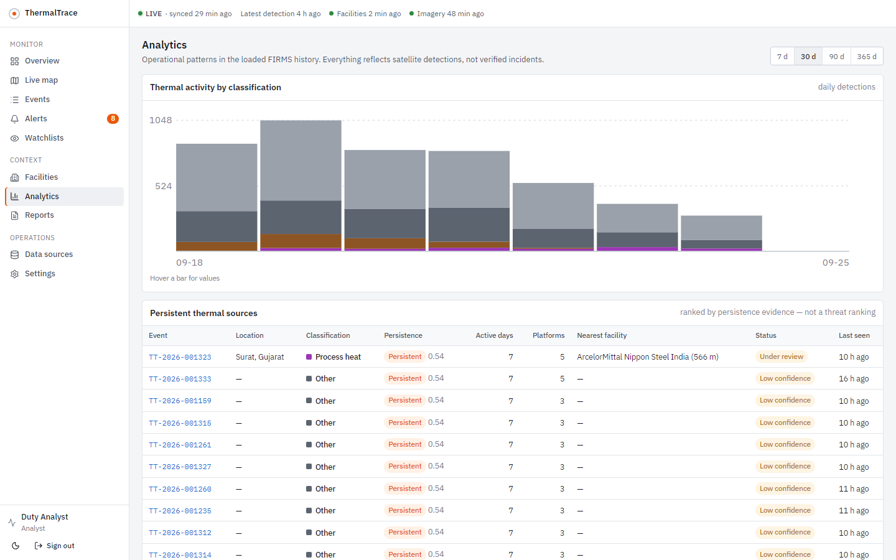

# ThermalTrace

**Evidence-based detection, classification and monitoring of industrial fires and persistent thermal sources.**
Built for SIH26162 (NTRO): *AI-Based Detection and Classification of Industrial Fires and Persistent Thermal Sources Using NASA FIRMS, OSM and Satellite Data.*



## The problem

NASA FIRMS reports thousands of thermal anomalies a day over South Asia. A bare hot pixel does not tell an analyst what it is, whether it is new, or whether it matters. The candidates include:

- a refinery flare,
- a steel furnace,
- a coal seam that has burned for decades,
- a crop-residue fire, or
- an industrial accident.

## What ThermalTrace does

For every thermal event ThermalTrace answers **where, when, how long, what type, which facilities are nearby, what the satellite and weather data show, what the history is, what the model used, how confident the system is, what is missing, and what the analyst decided**. Each answer carries its provenance.

The processing chain is:

FIRMS (MODIS + VIIRS, all satellites)
→ normalisation
→ spatio-temporal event clustering
→ OSM, WRI, GEM and CEA facility context
→ persistence engine
→ weather
→ Sentinel-2 scenes
→ explicit features
→ rule cascade and LightGBM + SHAP
→ transparent confidence
→ evidence bundle
→ analyst review
→ alerts, watchlists and PDF reports.

The system never presents uncertain output as fact:

- A classification reads, for example, *Industrial process heat — High confidence (0.73) — not independently verified*.
- `CONFIRMED` requires an imagery check.
- Weak evidence is shown as **Insufficient evidence — manual review required**.

## Architecture

```
FIRMS · Overpass · WRI/GEM/CEA · Sentinel-2 STAC · Open-Meteo · Nominatim
                 │ (retries, backoff, cache, health tracking)
     worker (bulk lane + scheduler) · worker (interactive lane)   ← Postgres SKIP LOCKED job queue
                 │
        PostgreSQL 16 + PostGIS 3.4 (Alembic, 40 tables)
                 │
      FastAPI /api/v1 (JWT, roles, audit, rate limits)
                 │
   React + MapLibre web app: desktop analyst workspace · mobile PWA shell
```

See [docs/ARCHITECTURE.md](docs/ARCHITECTURE.md) for details.

## Features

- **Live map**: viewport-bounded loading, clustering, a facility layer, event footprint and pixels, potential dispersion direction, replay, and a Sentinel-2 basemap.
- **Investigation**: summary answers, evidence confidence matrix, confidence components, thermal fingerprint, distance-ranked facilities, persistence and evolution, a satellite before/after swipe, weather, model evidence (rule trace and SHAP), and full provenance.
- **Analyst workflow**: confirm, reclassify, reject, false positive, escalate; notes and evidence links; assignment. Every decision feeds the training dataset.
- **Monitoring**: alert rules (for example "persistent events within 5 km of a refinery") with in-app, email and push delivery; watchlists (facilities, points, districts, polygons); persistent-source ranking.
- **Reporting**: PDF investigation reports with source attribution.
- **Operations**: data-source health, local facility index coverage, ingestion runs, jobs, workers, model cards, feature pipeline, audit log.
- **Triage and search**: explainable triage priority ordering the review queue (not a risk score), and global search across event IDs, districts, facilities, classifications and coordinates.
- **Mobile**: bottom navigation, full-screen map with a bottom sheet, swipeable evidence cards, "near me", offline reads, Web Push.

| | |
|---|---|
|  |  |
|  |  |

## Tech stack

| Layer | Technology |
|---|---|
| Backend | Python 3.12, FastAPI, Pydantic v2, SQLAlchemy 2, GeoAlchemy2, Alembic, psycopg 3, httpx |
| Data and ML | PostGIS 3.4, LightGBM, SHAP, scikit-learn, pandas, ReportLab, matplotlib |
| Frontend | React 18, TypeScript, Vite, MapLibre GL, TanStack Query, React Router |
| Testing | pytest (unit, ML, PostGIS integration), Playwright (desktop and mobile acceptance) |
| Delivery | Docker, docker-compose, GitHub Actions |

## Quick start

```bash
cp .env.development.example .env
docker compose up -d --build
docker compose exec api python -m app.cli create-user --email you@example.org --name "Your Name" --role admin
docker compose exec api python -m app.cli import-registry --source wri_gppd     # optional: ~1,600 Indian power plants
```

Then:

1. Open http://localhost:5173 and sign in.
2. The scheduler pulls live FIRMS detections within minutes (no key needed), then clusters, classifies and enriches them.
3. The API docs are at http://localhost:8000/api/docs.

To run the processes outside Docker, see [docs/DEPLOYMENT.md](docs/DEPLOYMENT.md).

### Environment

Every variable is documented, and tagged REQUIRED / OPTIONAL / PROVIDER, in [.env.example](.env.example). Only the database and `SECRET_KEY` are required. FIRMS live polling, OSM, Sentinel-2 search, weather and geocoding all work without keys. See [docs/REQUIRED_CREDENTIALS.md](docs/REQUIRED_CREDENTIALS.md) for what each optional credential unlocks.

### Operator CLI

```bash
python -m app.cli ingest --window 7d          # FIRMS NRT, all sensors
python -m app.cli process [--all]             # cluster + classify + alerts
python -m app.cli enrich --limit 40           # OSM, weather, imagery, geocoding
python -m app.cli sync-facilities --tiles 4   # local OSM facility index (busiest 1-degree tiles first)
python -m app.cli import-registry --source gem --path tracker.xlsx --version 2026-H1 --published 2026-07-01
python -m app.cli train                       # LightGBM on adjudicated + weak labels (model card stored)
```

## Testing

```bash
cd backend && TEST_DATABASE_URL=postgresql+psycopg://…/thermaltrace_test pytest    # unit + ML + PostGIS integration
cd frontend && npm run typecheck && npm test && npm run build && npm run test:e2e  # Vitest + Playwright
```

See [docs/TESTING.md](docs/TESTING.md) for coverage and the recorded acceptance run.

## Documentation

- [Product](docs/PRODUCT.md)
- [Architecture](docs/ARCHITECTURE.md)
- [API](docs/API.md)
- [Database](docs/DATABASE.md)
- [Data sources](docs/DATA_SOURCES.md)
- [ML and confidence](docs/ML.md)
- [GIS](docs/GIS.md)
- [Deployment](docs/DEPLOYMENT.md)
- [Security](docs/SECURITY.md)
- [Testing](docs/TESTING.md)
- [Master codebase audit](docs/MASTER_CODEBASE_AUDIT.md)
- [Master feature matrix](docs/MASTER_FEATURE_MATRIX.md)
- [Feature integration log](docs/FEATURE_INTEGRATION_LOG.md)
- [API integration matrix](docs/API_INTEGRATION_MATRIX.md)
- [Database audit](docs/DATABASE_AUDIT.md)
- [Security audit](docs/SECURITY_AUDIT.md)
- [Repository audit (phase 1)](docs/REPOSITORY_AUDIT.md)
- [Bug fixes](docs/BUG_FIXES.md)
- [Final status](docs/FINAL_STATUS.md)
- [Feature roadmap](docs/FEATURE_ROADMAP.md)
- [Research](docs/01-research.md)
- [SIH submission](docs/SIH-SUBMISSION.md)

## Limitations

- Persistence is only as deep as the loaded FIRMS history (currently days, not years).
- OSM industrial coverage in India is incomplete.
- Public Overpass is slow.
- Satellite imagery is provided for analyst comparison and is not automatically analysed.
- A trained ML model needs labelled data before it replaces the rule cascade.

The full list is in [docs/FINAL_STATUS.md](docs/FINAL_STATUS.md).

## Attribution

NASA FIRMS · © OpenStreetMap contributors (ODbL) · WRI Global Power Plant Database (CC BY 4.0) · Copernicus Sentinel-2 data via Element84 Earth Search and Copernicus Data Space · Open-Meteo (CC BY 4.0) · Basemaps © CARTO · Sentinel-2 cloudless by EOX (CC BY-NC-SA 4.0).
