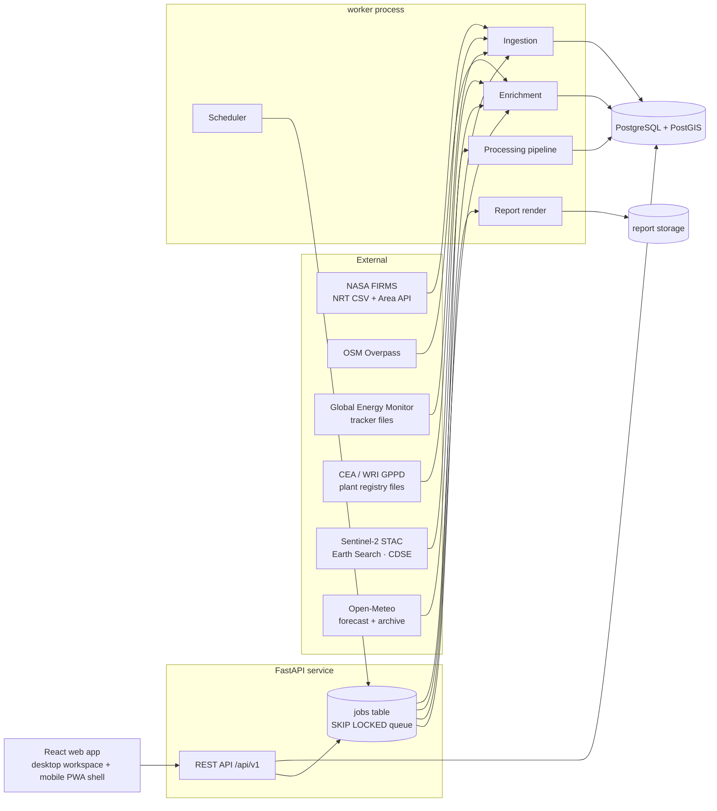

# ThermalTrace — Architecture

This document is the source of truth for how the platform fits together. For how the codebase came to be, see `PROJECT_HISTORY.md`.

## 1. System overview



## 2. Decisions

| Concern | Decision | Why |
|---|---|---|
| API | FastAPI with Pydantic v2 and a versioned `/api/v1` prefix | Both source repos already use it. It gives typed schemas and OpenAPI for free. |
| DB access | SQLAlchemy 2.0 (sync) + psycopg 3 + GeoAlchemy2, pooled engine | ORM for CRUD. Raw parameterized SQL (`text()`) for heavy spatial aggregates in repositories. Sync is enough, since FastAPI runs sync endpoints in a threadpool. |
| Migrations | Alembic | Fixes schema drift (R2-D11 / R1-B11, see `PROJECT_HISTORY.md`). |
| Background jobs | **Postgres-backed queue** (`jobs` table, `FOR UPDATE SKIP LOCKED`) with a separate `worker` process and scheduler | Gives durable, idempotent, observable jobs without adding Redis to a 24-hour build. It is a well-understood pattern. Celery/RQ remain a drop-in later. |
| Cache | `api_cache` table with TTLs | Covers Overpass, weather and STAC responses. Postgres already exists, so no Redis. |
| Auth | Own JWT (HS256) with server-side session rows (revocable `jti`), bcrypt. Roles: `viewer < analyst < supervisor < admin` | No backdoor. Roles are assigned by an admin only. |
| ML | `BaseClassifier` interface with `RuleCascadeClassifier` (deterministic, evidence-producing) and `GradientBoostingClassifier` (LightGBM + SHAP TreeExplainer) | The GBM is trained on weak labels plus analyst adjudications, and this is stated in the model card. When the models disagree, confidence goes down. |
| Frontend | React 18 + Vite + TS + MapLibre GL + TanStack Query + React Router | Extends the existing R2 frontend. |
| Mobile | The same codebase serves a **dedicated mobile shell** (bottom nav, bottom sheets, full-screen map) as an installable PWA with a service-worker cache, geolocation and Web Push | It shares types, API client, tokens and business logic without forking an ecosystem. An Expo/React Native app is a roadmap item and can reuse `src/lib` (API client and types). |
| Basemap | CARTO Positron / Dark Matter vector styles (configurable `VITE_MAP_STYLE_*`) | No key needed. Attribution is shown. |
| Reports | ReportLab PDF rendered in the worker, with a matplotlib schematic map | Pure Python and works on every platform. |

## 3. Backend layout

```
backend/app/
  main.py                 app factory, middleware, router mounting
  core/                   config, logging (JSON + request id), errors, security, deps
  db/                     engine/session, Base
  models/                 ORM models (one module per bounded context)
  schemas/                Pydantic request/response models
  repositories/           query functions (spatial SQL lives here — never in routers)
  integrations/           firms, overpass, gem, cea, sentinel, weather, http(retry/backoff)
  gis/                    geodesy helpers, clustering primitives
  processing/             clustering → persistence → attribution → features → classify
                          → confidence → evidence → data quality (pipeline.py orchestrates)
  ml/                     base, rule_cascade, gbm, registry, training, shap explain
  services/               alerts, watchlists, reports, analytics, reviews, source health
  workers/                queue, scheduler, task registry, worker entrypoint
  api/v1/                 routers
  cli.py                  create-admin, migrate helpers, enqueue jobs, train model
```

## 4. Core processing pipeline

1. **Ingest** (`firms_ingest`). Pull each configured FIRMS dataset: MODIS C6.1, VIIRS S-NPP, NOAA-20 and NOAA-21. Normalize, then upsert on `(dataset, lat, lon, acq_datetime)`. Record the run, duplicates and errors, and advance the checkpoint.
2. **Cluster** (`process_events`). Unassigned detections join an existing event when they fall within **1.5 km** of its centroid (`ST_DWithin`) and within **the temporal gap tolerance (5 days)** of its `last_detected`. Otherwise they seed new events through a DBSCAN-like connected-components pass over the new batch. Event statistics are recomputed set-based.
3. **Persistence**. Computed per event from daily observation rows. The inputs are active days, span, observation frequency (active days / span), longest gap, FRP coefficient of variation and sensor agreement. The output is `TRANSIENT` / `RECURRING` / `PERSISTENT`, and every metric is stored.
4. **Attribution**. Rank facilities within 10 km by distance, with type, status, source and confidence. Distance-decay evidence (e.g. "0.7 km from a mapped refinery"). Never binary.
5. **Enrichment** (async, cached). Nearby OSM infrastructure and land use (Overpass, tiled around the event), weather at acquisition time (Open-Meteo archive/forecast), and Sentinel-2 scenes before, after and latest (STAC).
6. **Features**. An explicit, named feature vector with a documented origin for each feature (see `ML.md`).
7. **Classify**. The rule cascade and the GBM each produce a stored `model_predictions` row. The GBM also stores SHAP values.
8. **Confidence**. A weighted, transparent combination of components (ML probability, model agreement, data quality, facility evidence, sensor agreement, temporal evidence, satellite availability, weather availability). The result maps to `HIGH` / `MODERATE` / `LOW` / `INSUFFICIENT EVIDENCE`. Analyst decisions override the displayed state (`ANALYST CONFIRMED` / `ANALYST REJECTED`).
9. **Evidence**. `classification_evidence` rows, each with a category, direction, strength and provenance.
10. **Alerts**. Rules are evaluated against changed events. Deliveries go in-app, by email (SMTP if configured) and by Web Push (VAPID if configured).

## 5. Data modes

`data_mode ∈ {live, historical, demo}` is recorded on every detection and propagated to events.

- `DEMO_MODE=false` (default): the synthetic dataset **cannot** be loaded.
- A live-source failure produces a failed ingestion run and a "source unavailable" status, **never** substituted records.
- The UI shows a persistent DEMO banner whenever demo records exist in the result set.

## 6. Deployment topology

- `db`: PostGIS 16-3.4
- `api`: uvicorn, stateless, horizontally scalable
- `worker`: 1..n processes (queue is SKIP LOCKED safe)
- `web`: static build (Vercel/Netlify/nginx). `VITE_API_BASE_URL` points at the API.

See `DEPLOYMENT.md`.

## 7. Job queue reliability

- **Heartbeats while working:** each worker writes `worker_heartbeats` every 30 s, also from a background thread while a
  job runs. Every worker sweeps once a minute for jobs still `running` whose worker has not been seen for 3 minutes
  (`queue.recover_stale`): those are requeued, or failed once they have used all their attempts, so a job that kills its
  worker cannot loop forever. A long job of a live worker is never taken over.
- **One clustering pass at a time:** `process_events` runs in the bulk lane only and holds a Postgres advisory lock (on a
  dedicated connection) for the clustering pass; a second pass defers itself for a minute.
- **Continuations:** a job that queues its next pass alternates between two dedupe keys, so a chain never suppresses
  itself, while any other pass of the same kind still does. A model (de)activation re-analysis has its own key.
- **Idempotency in the database:** detections, facility sources, facility links, daily observations, satellite scenes,
  imagery analyses, land cover, weather, land context, alerts (rule, event), registry stations, current
  classification (0013) and alert deliveries (0013) have unique constraints; ingestion and enrichment upsert or
  delete-and-insert per event, so re-running them does not duplicate rows.
- **Alerts:** an alert is committed before any e-mail or push leaves the system, and its rule row is locked while the
  cooldown is checked and delivered; a retried job cannot send twice. Push delivery continues past a failing device and
  removes subscriptions the browser has dropped (HTTP 404 / 410).
- **Housekeeping** removes succeeded jobs older than 30 days (failed ones are kept for diagnosis).
- **Limits:** events have no natural unique key (clustering is serialised instead); `model_predictions` keeps every
  analysis (history), so it grows with re-analysis.
